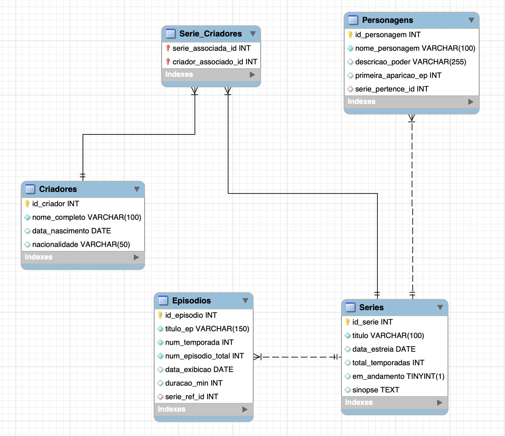

### Base de Dados "Animacoes"  

* **Apresentação**

Criei essa base de dados para estudar para a prova de Banco de Dados II, em meu 3 semestre da faculdade.

Gosto muito de animações em formato de série, principalmente as que têm soundtrack no desenvolvimento, então foi um projeto bem gostoso de elaborar e explorar.

(Incluvise, uma boa ideia de feature futura: tabela de músicas relacionada à suas respectivas séries e epsódios pertencentes)
  

### Estrutura e Relacionamentos  

* **Tabelas**

  * **`Criadores`**: Armazena as informações biográficas dos autores (nome, nascimento, nacionalidade).
  * **`Series`**: O núcleo do banco, contendo os dados principais das animações (título, sinopse, temporadas).
  * **`Personagens`**: Contém a lista personagens das obras, detalhando seus poderes e origem.
  * **`Episodios`**: Registra os dados técnicos de cada capítulo (duração, data de exibição, número do episódio).
  * **`Serie_Criadores`**: Tabela associativa, que serve exclusivamente para ligar criadores às suas respectivas séries.

* **Relações (1:N)**
  * **`Series` — `Personagens` (1:N):** Uma série possui muitos personagens, mas cada personagem pertence a apenas uma série.
  * **`Series` — `Episódios` (1:N):** Uma série é composta por vários episódios; cada episódio está vinculado a uma única série mãe.

* **Tabelas de Ligação (N:N)**
  * **`Series` — `Criadores` (N:N):** Relacionamento intermediado pela tabela `Serie_Criadores`.
    * **`Series` — `Serie_Criadores` (1:N):** Uma série pode aparecer várias vezes nesta tabela de junção para ser conectada a diferentes autores.
    * **`Criadores` — `erie_Criadores` (1:N):** Um criador pode aparecer várias vezes nesta tabela para representar sua participação em diferentes projetos.

 

### Modelo DER

